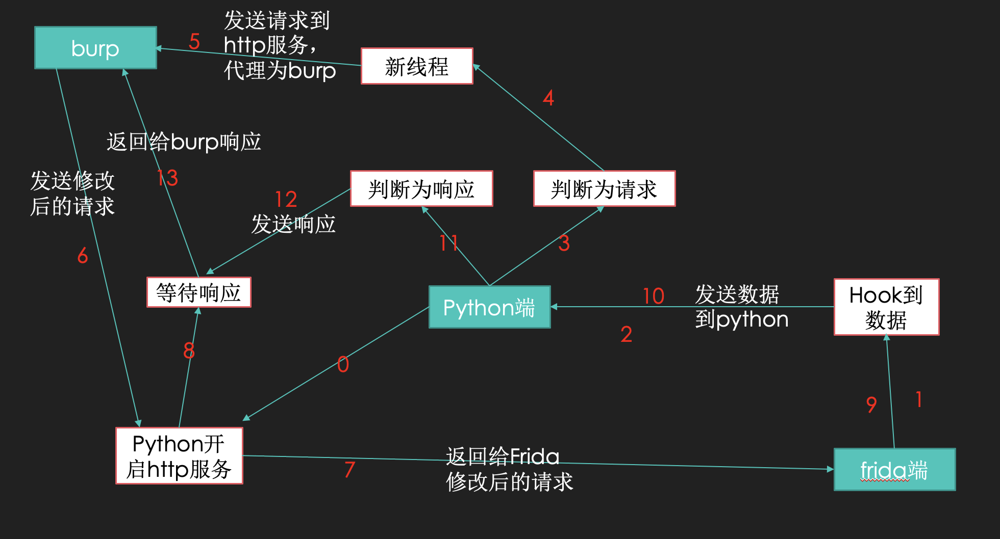

# mPaas-frida-hook
mPaas请求包加密frida hook解决方案
在MpaasPentestTool项目的思路上进行优化

实现请求响应展现在burp的一个请求包内

### 运行流程：



最新更新了hook的类，通过请求时添加uuid来多线程识别请求包与对应的响应包，不再为单线程改为多线程，且请求包hook的更完善


### 食用方法

```
# 开启frida
	adb shell
	cd data/local/tmp
	./frida
	
# 转发端口
	adb forward tcp:27042 tcp:27042 && adb forward tcp:27043 tcp:27043
	
# 在run.py内修改要hook的app名称，是名字不是包名
	session = frida.get_remote_device().attach('xxx')  # app的名字

# 打开要hook的app后运行run.py
	python3 run.py
```


### 声明

项目仅作为交流学习使用，勿用于非法途径


